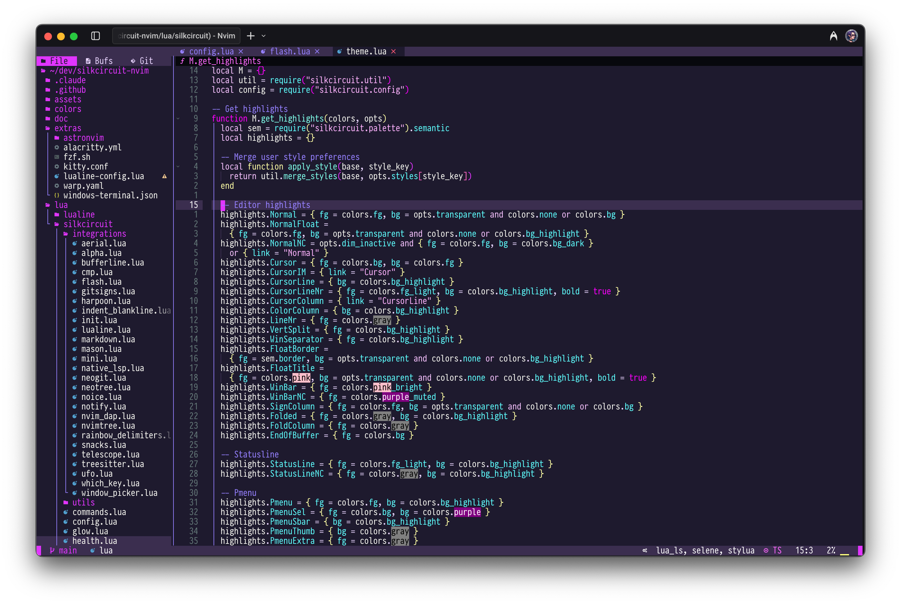

# 💜⚡ SilkCircuit: Electric Dreams for Neovim 🌃

<div align="center">

[](https://neovim.io/)
[](https://www.lua.org/)
[](https://opensource.org/licenses/MIT)

[](https://github.com/hyperb1iss/silkcircuit-nvim)
[](https://www.w3.org/WAI/WCAG21/quickref/)
[](https://github.com/hyperb1iss/silkcircuit-nvim)

[](https://github.com/hyperb1iss/silkcircuit-nvim#-plugin-support)
[](https://github.com/hyperb1iss/silkcircuit-nvim#-theme-variants)
[](https://github.com/hyperb1iss/silkcircuit-nvim#-glow-mode)

🌌 _Pure electric energy with vibrant purples, blazing pinks, and neon accents_ 🎆

[⚡ Installation](#-installation) • [💜 Features](#-features) • [🎨 Configuration](#-configuration) • [🔮 Plugin Support](#-plugin-support)

</div>

<div align="center">
  
</div>

## 🎭 Overview

SilkCircuit pumps maximum visual voltage through your Neovim. Electric purples 💜, blazing pinks 🌸, and neon cyans 💎 create a coding environment that's both striking and readable. Engineered for speed with <5ms load times and WCAG AA contrast compliance.

## 🦄 Features

- 🎪 **Electric Color System** — Vibrant palette with semantic color mappings
- 🏎️ **<5ms Load Time** — Bytecode compilation with intelligent caching
- 👁️ **WCAG AA Compliant** — Validated contrast ratios for extended coding sessions
- 🎛️ **Theme Variants** — Neon (100%), Vibrant (85%), and Soft (70%) intensity modes
- 🔮 **40+ Plugin Integrations** — Auto-detected support for your entire toolchain
- 🌟 **Glow Mode** — Enhanced highlights for maximum visibility
- 💾 **Persistent Preferences** — Settings survive across sessions

## 💫 Installation

### 🎯 Using [lazy.nvim](https://github.com/folke/lazy.nvim) (Recommended)

```lua
{
  "hyperb1iss/silkcircuit-nvim",
  lazy = false,
  priority = 1000,
  config = function()
    vim.cmd.colorscheme("silkcircuit")
  end,
}
```

### 📦 Using [packer.nvim](https://github.com/wbthomason/packer.nvim)

```lua
use {
  "hyperb1iss/silkcircuit-nvim",
  config = function()
    vim.cmd("colorscheme silkcircuit")
  end
}
```

### 🔮 Using [vim-plug](https://github.com/junegunn/vim-plug)

```vim
Plug 'hyperb1iss/silkcircuit-nvim'
colorscheme silkcircuit
```

## 🛸 AstroNvim

SilkCircuit integrates seamlessly with AstroNvim, just like any community colorscheme:

```lua
-- In your lua/community.lua file:
return {
  "AstroNvim/astrocommunity",
  { "hyperb1iss/silkcircuit-nvim", name = "silkcircuit" },
}

-- In your lua/plugins/astroui.lua file:
return {
  "AstroNvim/astroui",
  opts = {
    colorscheme = "silkcircuit",
  },
}
```

That's it! No additional configuration needed.

## 🎨 Configuration

### 🎪 Default Setup

```lua
require("silkcircuit").setup({
  transparent = false,     -- Enable transparent background
  terminal_colors = true,  -- Configure terminal colors
  dim_inactive = false,    -- Dim inactive windows
  variant = "neon",       -- Theme variant: "neon" | "vibrant" | "soft"
  glow_mode = false,      -- Enable glow mode

  styles = {
    comments = { italic = true },
    keywords = { bold = true },
    functions = { bold = true, italic = true },
    variables = {},
    strings = { italic = true },
  },

  integrations = {
    -- Auto-detected by default
    telescope = true,
    neotree = true,
    notify = true,
    cmp = true,
    mini = true,
    -- See :h silkcircuit-integrations for full list
  },
})
```

### 🌈 Theme Variants

Switch between intensity levels:

```lua
-- Via setup
require("silkcircuit").setup({
  variant = "vibrant", -- "neon" | "vibrant" | "soft"
})

-- Or use commands
:SilkCircuit neon     -- 100% intensity
:SilkCircuit vibrant  -- 85% intensity
:SilkCircuit soft     -- 70% intensity
```

### ✨ Glow Mode

Enhanced highlights for maximum visibility:

```lua
-- Toggle glow mode
:SilkCircuitGlow

-- Or in setup
require("silkcircuit").setup({
  glow_mode = true,
})
```

### 🌌 Transparent Background

For a sleek, transparent look:

```lua
require("silkcircuit").setup({
  transparent = true,
})
```

### 🎯 Custom Highlights

Override any highlight group:

```lua
require("silkcircuit").setup({
  on_highlights = function(highlights, colors)
    highlights.Function = { fg = colors.cyan, bold = true }
    highlights.Comment = { fg = colors.gray, italic = true }
  end,
})
```

## 🌟 Plugin Support

SilkCircuit auto-detects and themes 40+ plugins:

**🎯 Core Functionality**

- 🔭 Telescope → Fuzzy finder
- 🌳 Neo-tree → File explorer
- 💡 LSP → Language servers
- 🌿 Treesitter → Syntax highlighting
- 🎹 nvim-cmp → Completion
- 📦 Mason → Package manager

**🏃 Navigation & Motion**

- ⚡ Flash / Leap → Jump motions
- 🎣 Harpoon → File marks
- 🗝️ Which-Key → Keybinding hints
- 🦘 Mini.jump → Enhanced jumps

**🔧 Git & Development**

- 📊 Gitsigns → Git indicators
- 🎭 Neogit → Git interface
- 🐛 DAP → Debugging
- 🧹 none-ls → Formatting/linting

**💎 UI Components**

- 📍 Lualine → Status line
- 📑 BufferLine → Buffer tabs
- 🔔 Notify / Noice → Notifications
- 🎪 Alpha → Dashboard
- 📏 Mini.statusline → Minimal status

**🎨 Editor Enhancement**

- 🌈 Rainbow Delimiters → Bracket pairs
- 📐 Indent Blankline → Indentation guides
- 🔍 Mini.indentscope → Active indent
- 💫 Mini.cursorword → Word highlighting

All integrations activate automatically when plugins are detected.

## 🌃 Terminal Support

SilkCircuit includes matching themes for popular terminals:

```bash
# Copy the appropriate theme file from extras/
cp extras/alacritty.toml ~/.config/alacritty/themes/silkcircuit.toml
cp extras/kitty.conf ~/.config/kitty/themes/silkcircuit.conf
cp extras/wezterm.lua ~/.config/wezterm/colors/silkcircuit.lua
```

## 💜 Color Palette

| Color | Hex | Preview |
|-------|-----|---------|
| Background | `#0a0a0f` |  |
| Foreground | `#e0e0e0` |  |
| Purple | `#e135ff` |  |
| Pink | `#ff79c6` |  |
| Cyan | `#80ffea` |  |
| Green | `#50fa7b` |  |
| Yellow | `#f1fa8c` |  |
| Orange | `#ffb86c` |  |

## 🛠️ Troubleshooting

**🤔 Theme not loading?**

- ⚡ Neovim 0.8.0+ required
- 🎨 Add `vim.opt.termguicolors = true` to config
- 📦 Verify plugin installation: `:Lazy` or `:PackerStatus`

**🎭 Colors incorrect?**

- 🖥️ Terminal must support true colors
- 🔄 Test with different terminal emulator
- ⚙️ Verify terminal color settings

**🏎️ Performance issues?**

- 🩺 Run `:checkhealth silkcircuit` for diagnostics
- 🔐 Check cache directory permissions
- 🧹 Clear cache: `:SilkCircuitClearCache`

**💭 Need help?**

- 💜 Run `:checkhealth silkcircuit`
- 📬 Check [Issues](https://github.com/hyperb1iss/silkcircuit-nvim/issues)
- 📝 Include config and error messages

## 💖 Contributing

Contributions welcome! Submit issues and pull requests.

```bash
# Clone the repo
git clone https://github.com/hyperb1iss/silkcircuit-nvim.git
cd silkcircuit-nvim

# Install dev dependencies
make setup

# Run tests and linting
make test
make lint
```

See [STYLE_GUIDE.md](STYLE_GUIDE.md) and [CLAUDE.md](CLAUDE.md) for development guidelines.

## 📜 License

MIT License - see [LICENSE](LICENSE) for details.

---

<div align="center">

Created by [Stefanie Jane 🌠](https://github.com/hyperb1iss)

If you love SilkCircuit, [buy me a Monster Ultra Violet ⚡](https://ko-fi.com/hyperb1iss)

</div>
