# 💜⚡ SilkCircuit: Electric Meets Elegant

<div align="center">

[](https://github.com/hyperb1iss/silkcircuit)
[](https://www.w3.org/WAI/WCAG21/quickref/)
[](https://opensource.org/licenses/MIT)

[](https://neovim.io/)
[](https://marketplace.visualstudio.com/items?itemName=hyperb1iss.silkcircuit-theme)
[](https://chromewebstore.google.com/)

🌌 _A vibrant cyberpunk color system for your entire dev environment._ 🎆

[⚡ Quick Start](#-quick-start) · [💜 Neovim](#-neovim) · [🎨 Variants](#-variants) · [🌃 Full Ecosystem](#-full-ecosystem)

</div>

<div align="center">
  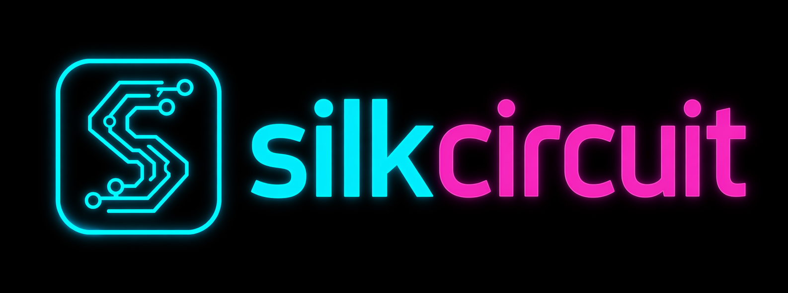
</div>

<div align="center">
  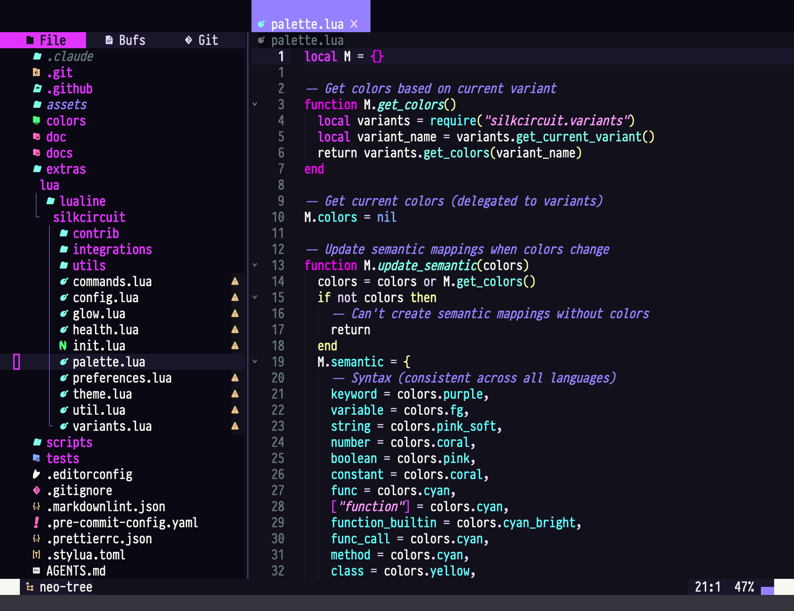
</div>

> [!TIP]
> 🤖 Building a SilkCircuit integration with AI? Point your agent at [STYLE_GUIDE.md](STYLE_GUIDE.md).

## 🎭 What Is SilkCircuit?

SilkCircuit is a unified color system that themes your entire workflow: editors, terminals, browsers, system monitors, and CLI tools. Every target shares the same palette, the same semantic color mappings, and the same five intensity variants. WCAG AA compliant across the board.

### 🌐 Platforms

| Category | Targets |
|----------|---------|
| 💻 **Editors** | Neovim (40+ plugin integrations), VS Code (Marketplace), AstroNvim |
| 🖥️ **Terminals** | Ghostty, Kitty, Alacritty, Warp, Windows Terminal |
| 🌐 **Browsers** | Chrome (Web Store, 5 variants + DevTools CSS) |
| 🔧 **CLI Tools** | btop, K9s, lazygit, bat, fzf, lsd, procs, atuin, Starship |
| ⚙️ **System** | COSMIC Desktop, fastfetch, dmesg, tmux |
| 🎯 **Other** | Git (delta integration), Slack, Lualine |

### 🎛️ Variants

Five intensity levels, all using the same underlying palette:

| Variant | Style | Best For |
|---------|-------|----------|
| ⚡ **Neon** | 100% saturated | Maximum vibrancy |
| 🔮 **Vibrant** | 85% intensity | Balanced energy |
| 🌸 **Soft** | 70% intensity | Extended sessions |
| 🌌 **Glow** | Ultra-dark bg, pure neon fg | Low-light / OLED |
| 🌅 **Dawn** | Light theme | Daytime & bright rooms |

## 🪄 Quick Start

### ⚡ Universal Installer

The fastest way to theme everything at once. Detects your installed tools and applies matching SilkCircuit configs with backups:

```bash
git clone https://github.com/hyperb1iss/silkcircuit.git
cd silkcircuit
./install.sh
```

### 🎯 Individual Platforms

Pick what you need:

<details>
<summary><b>🔮 Neovim</b> (lazy.nvim)</summary>

```lua
{
  "hyperb1iss/silkcircuit",
  lazy = false,
  priority = 1000,
  config = function()
    vim.cmd.colorscheme("silkcircuit")
  end,
}
```

</details>

<details>
<summary><b>📦 Neovim</b> (packer.nvim)</summary>

```lua
use {
  "hyperb1iss/silkcircuit",
  config = function()
    vim.cmd("colorscheme silkcircuit")
  end
}
```

</details>

<details>
<summary><b>🔌 Neovim</b> (vim-plug)</summary>

```vim
Plug 'hyperb1iss/silkcircuit'
colorscheme silkcircuit
```

</details>

<details>
<summary><b>💎 VS Code</b></summary>

Install from the [VS Code Marketplace](https://marketplace.visualstudio.com/items?itemName=hyperb1iss.silkcircuit-theme), or:

```bash
code --install-extension hyperb1iss.silkcircuit-theme
```

</details>

<details>
<summary><b>🌐 Chrome</b></summary>

Available on the Chrome Web Store (all 5 variants), or load unpacked:

```bash
make chrome
# chrome://extensions/ → Developer mode → Load unpacked
# Select: extras/chrome-theme/silkcircuit-{variant}/
```

</details>

<details>
<summary><b>🖥️ Terminals</b></summary>

```bash
# Ghostty: copy variant config to ~/.config/ghostty/
cp extras/ghostty/silkcircuit-neon ~/.config/ghostty/themes/

# Kitty
cp extras/kitty.conf ~/.config/kitty/themes/silkcircuit.conf

# Alacritty
cp extras/alacritty.yml ~/.config/alacritty/themes/silkcircuit.yml

# Warp
cp extras/warp.yaml ~/.warp/themes/silkcircuit.yaml

# Windows Terminal: import extras/windows-terminal.json in settings
```

</details>

<details>
<summary><b>🔧 CLI Tools</b></summary>

```bash
# btop (5 variants)
cp extras/btop/silkcircuit_*.theme ~/.config/btop/themes/

# K9s (5 variants)
cp extras/k9s/silkcircuit_*.yaml ~/.config/k9s/skins/

# Git colors with delta integration
cat extras/gitconfig >> ~/.gitconfig

# fzf
source extras/fzf.sh  # or add to .zshrc/.bashrc

# Starship prompt
cp extras/starship/silkcircuit.toml ~/.config/starship.toml
```

</details>

## 💜 Neovim

The Neovim theme is the most feature-rich target: bytecode-compiled for <5ms load times, 40+ auto-detected plugin integrations, and persistent preferences.

### 🎪 Configuration

```lua
require("silkcircuit").setup({
  transparent = false,
  terminal_colors = true,
  dim_inactive = false,
  variant = "neon",       -- "neon" | "vibrant" | "soft" | "glow" | "dawn"

  styles = {
    comments = { italic = true },
    keywords = { bold = true },
    functions = { bold = true, italic = true },
    variables = {},
    strings = { italic = true },
  },

  integrations = {
    telescope = true,     -- all auto-detected by default
    neotree = true,
    notify = true,
    cmp = true,
    mini = true,
  },
})
```

### 🔮 Plugin Support

All integrations activate automatically when plugins are detected.

- 🎯 **Core**: Telescope, Neo-tree, LSP, Treesitter, nvim-cmp, Mason
- 🏃 **Navigation**: Flash, Harpoon, Which-Key, Mini.jump
- 🔧 **Git & Dev**: Gitsigns, Neogit, DAP
- 💎 **UI**: Lualine, BufferLine, Notify, Noice, Alpha, Indent Blankline, Rainbow Delimiters

<div align="center">
  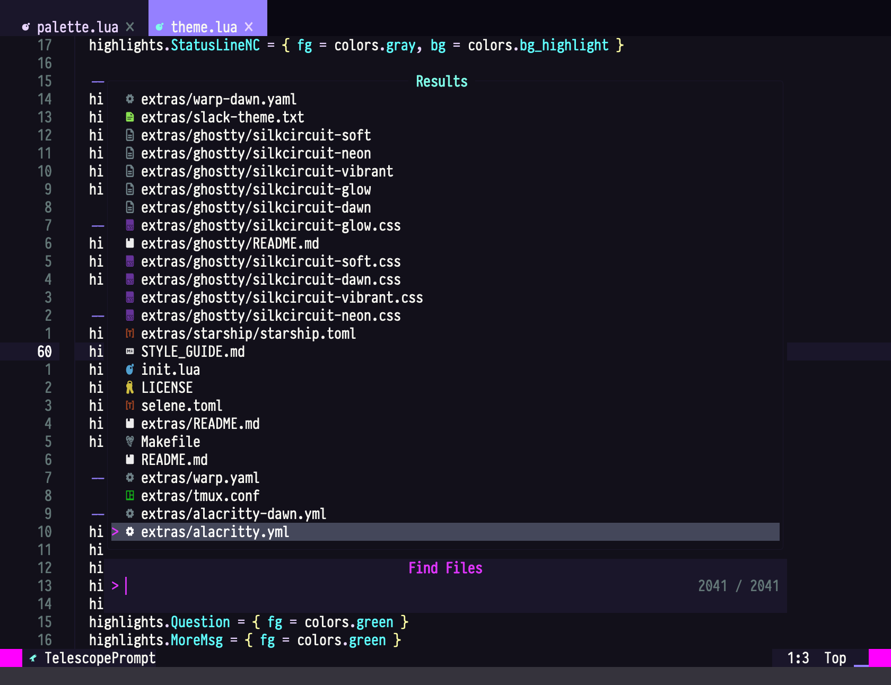
</div>

### 🛸 AstroNvim

```lua
return {
  "AstroNvim/astrocommunity",
  { "hyperb1iss/silkcircuit", name = "silkcircuit" },
}
```

### 🎮 Commands

| Command | Description |
|---------|-------------|
| `:SilkCircuit {variant}` | Switch variant (neon/vibrant/soft/glow/dawn) |
| `:SilkCircuitContrast` | Check WCAG contrast compliance |
| `:SilkCircuitCompile` | Compile theme for performance |
| `:SilkCircuitIntegrations` | Show detected plugin integrations |
| `:checkhealth silkcircuit` | Run diagnostics |

## 🌃 Full Ecosystem

See [extras/README.md](extras/README.md) for detailed setup instructions for every supported tool.

### 🎨 Color Palette

| Color | Hex | Usage |
|-------|-----|-------|
| Background | `#0a0a0f` |  |
| Foreground | `#e0e0e0` |  |
| 💜 Electric Purple | `#e135ff` |  Keywords, primary accents |
| 🌸 Hot Pink | `#ff79c6` |  Strings, secondary |
| 💎 Neon Cyan | `#80ffea` |  Functions, links |
| ✅ Success Green | `#50fa7b` |  Success states |
| ⚡ Electric Yellow | `#f1fa8c` |  Warnings, variables |
| 🔥 Warm Orange | `#ffb86c` |  Numbers, constants |

## 📸 Screenshot Gallery

<details>
<summary><b>Neovim</b></summary>
<br>

| Syntax Highlighting | Theme Highlights |
|:---:|:---:|
| 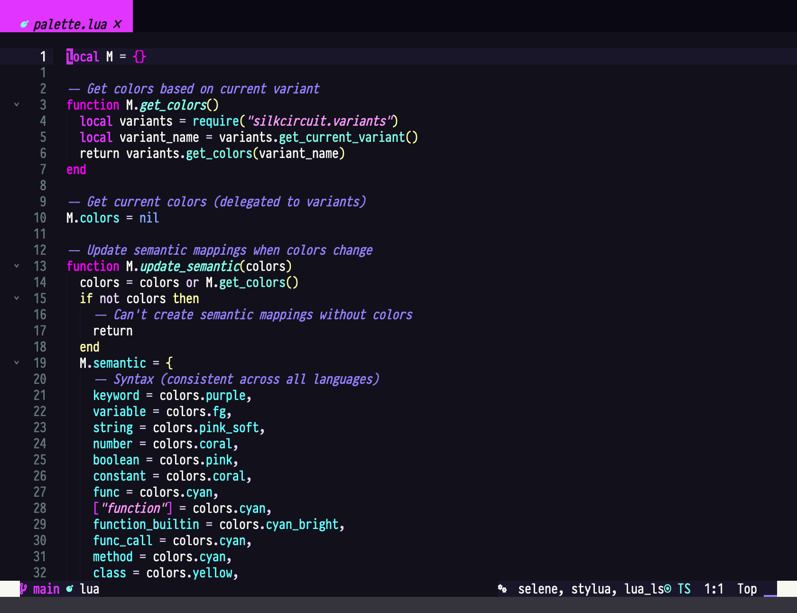 | 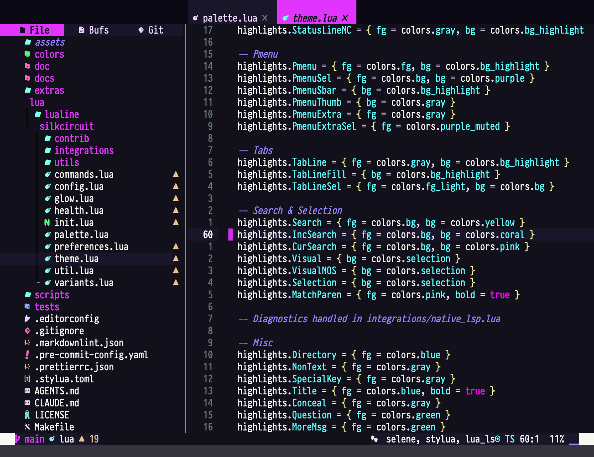 |

</details>

<details>
<summary><b>Terminal & CLI Tools</b></summary>
<br>

| lazygit | btop |
|:---:|:---:|
| 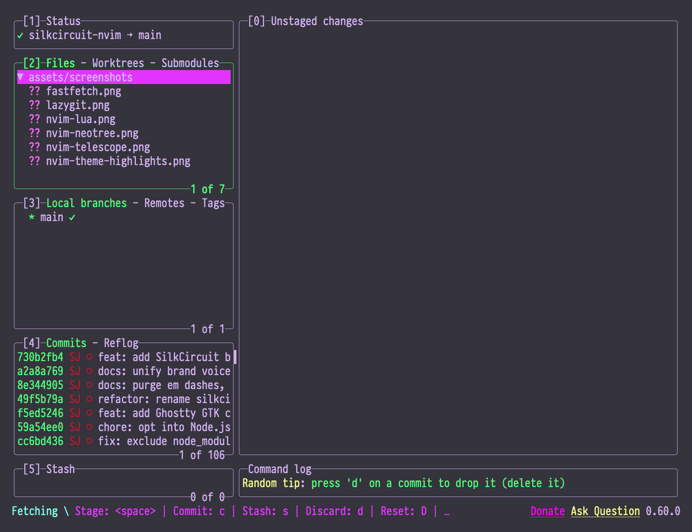 | 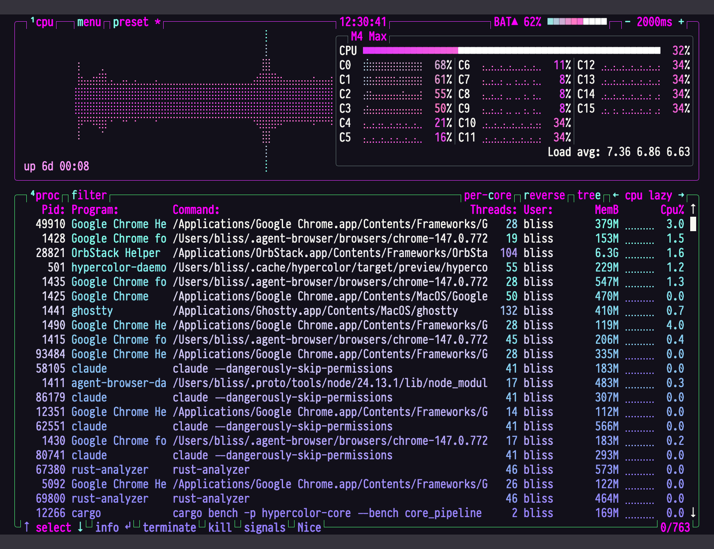 |

| bat | fzf |
|:---:|:---:|
| 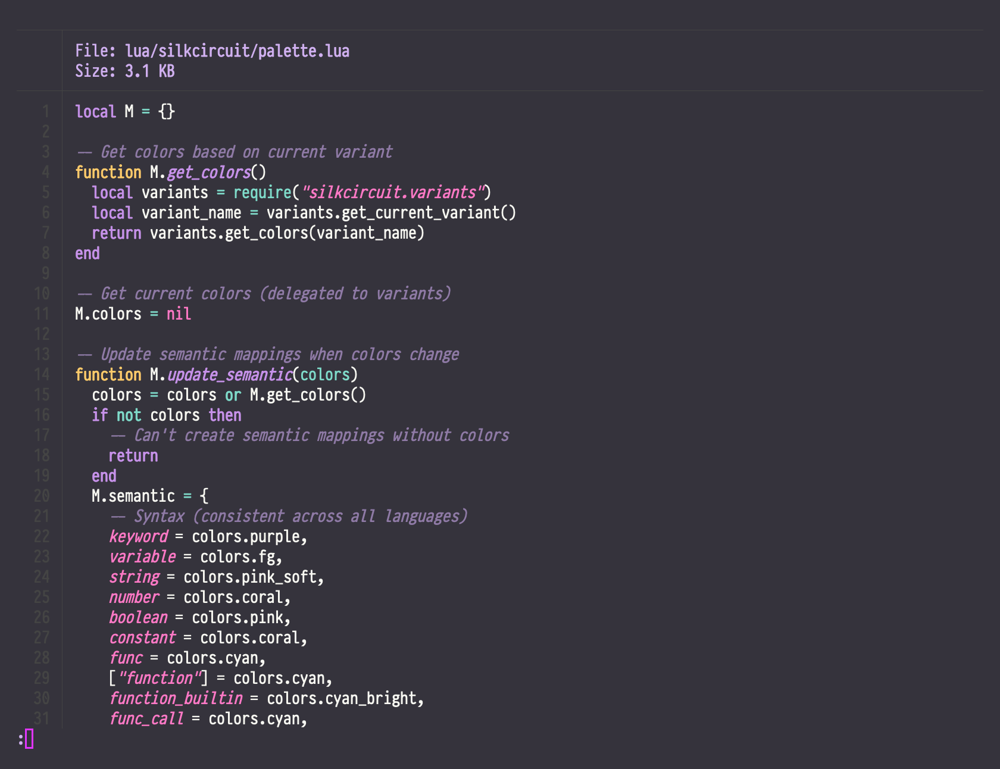 | 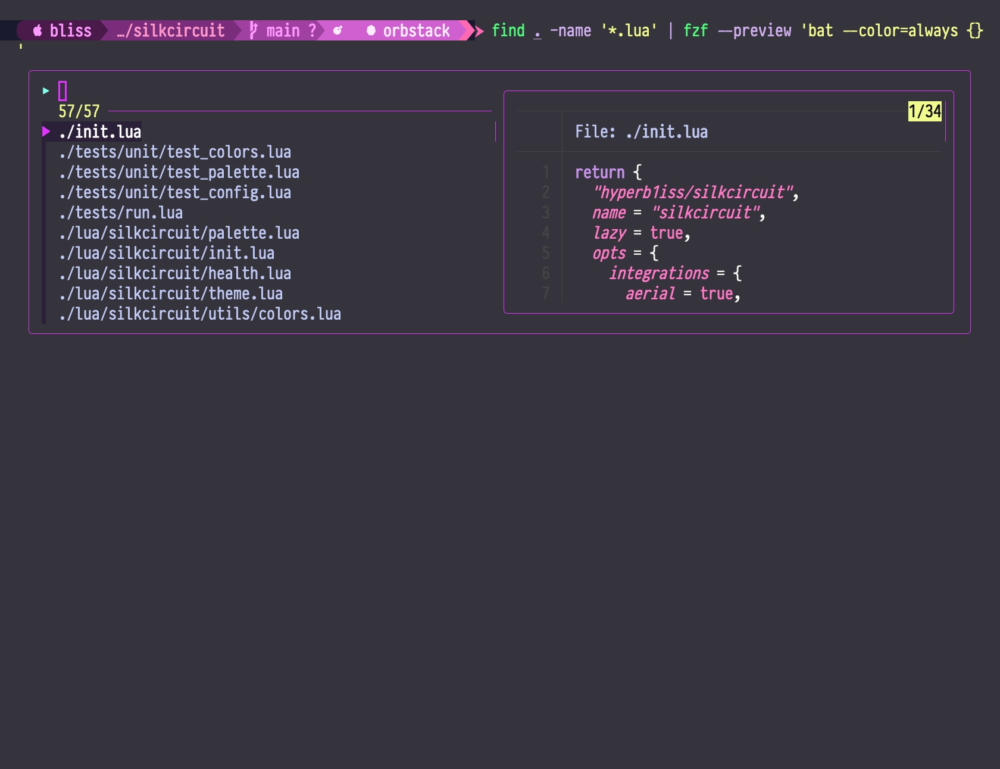 |

| git log | delta |
|:---:|:---:|
| 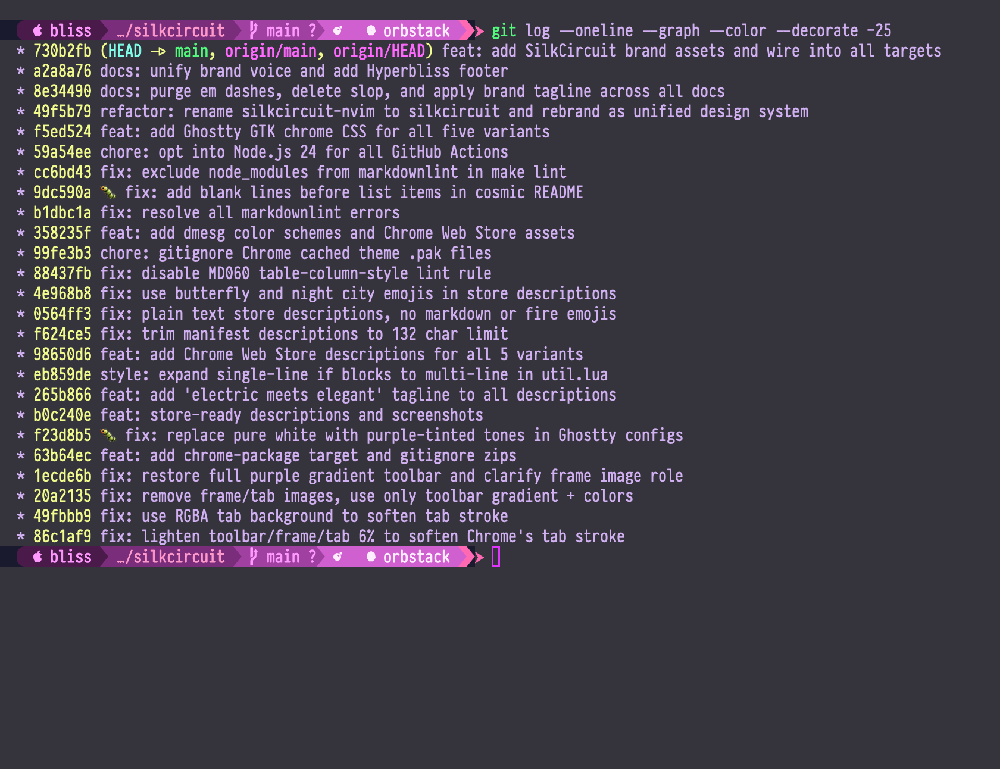 | 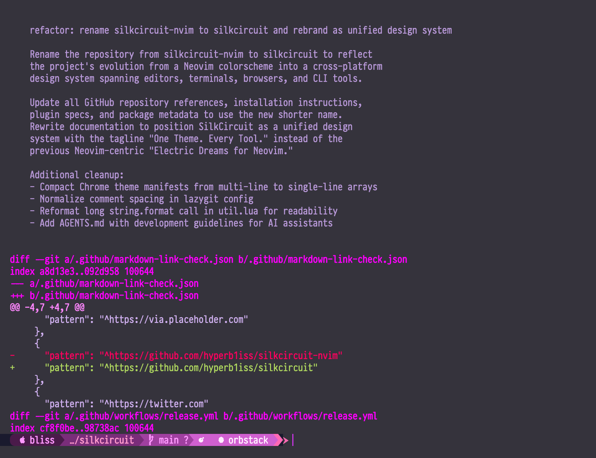 |

| lsd | procs |
|:---:|:---:|
| 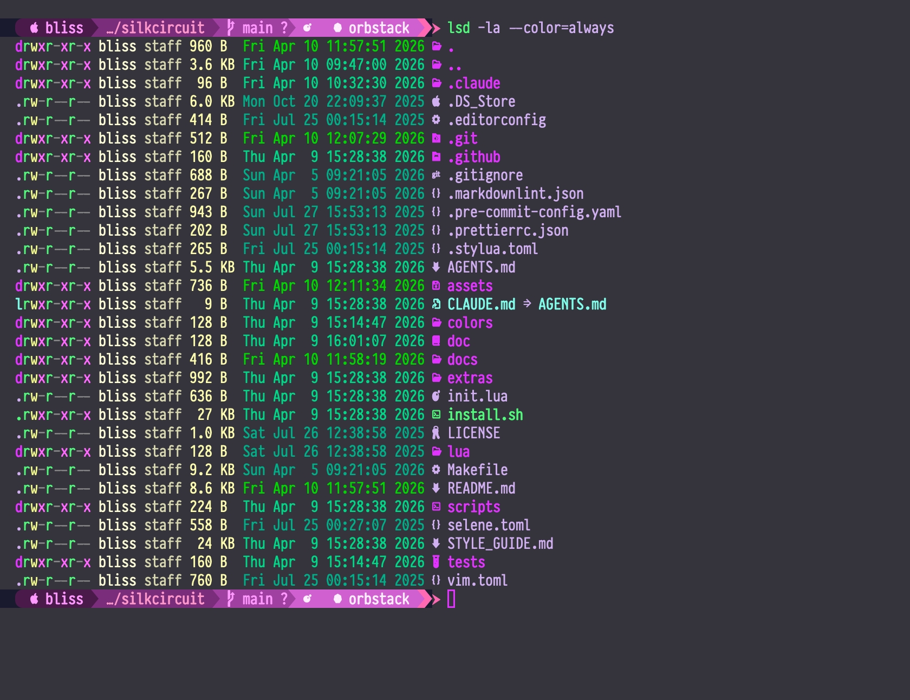 | 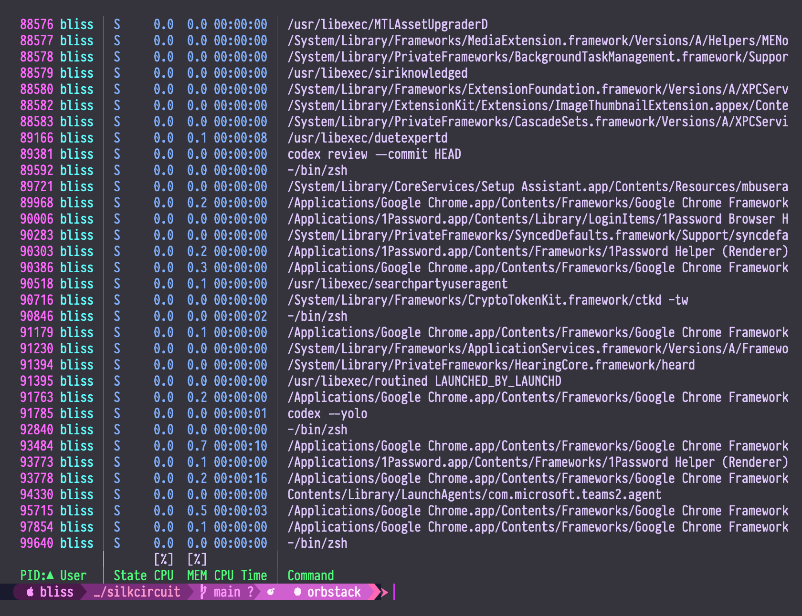 |

| fastfetch |
|:---:|
| 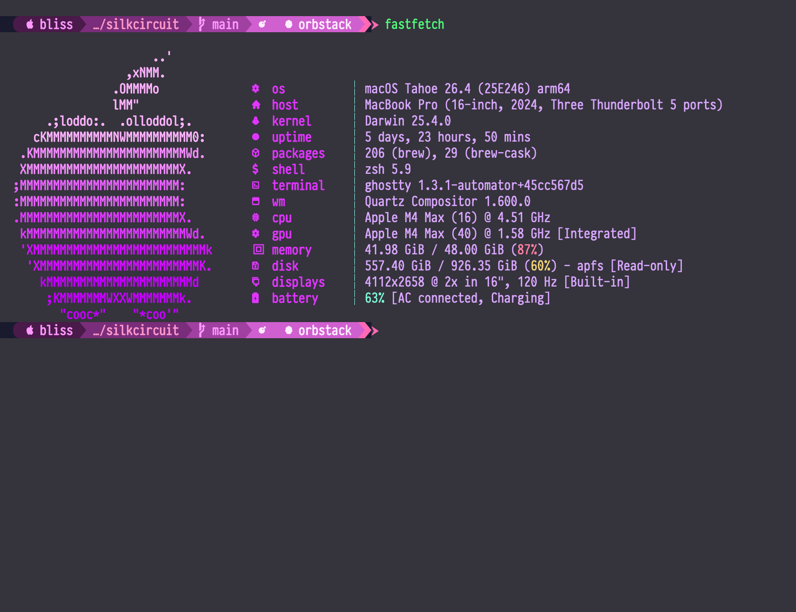 |

</details>

## 🛠️ Troubleshooting

**🤔 Neovim theme not loading?** Requires Neovim 0.8.0+ with `vim.opt.termguicolors = true`. Run `:checkhealth silkcircuit`.

**🎭 Colors look wrong?** Your terminal must support true colors (24-bit). Try a different terminal emulator if unsure.

**🏎️ Performance issues?** Run `:SilkCircuitCompile` to regenerate the bytecode cache.

**💭 Need help?** [Open an issue](https://github.com/hyperb1iss/silkcircuit/issues) with your config and error output.

## 💖 Contributing

```bash
git clone https://github.com/hyperb1iss/silkcircuit.git
cd silkcircuit
make setup    # install dev dependencies
make test     # run unit tests
make lint     # check code quality
```

See [STYLE_GUIDE.md](STYLE_GUIDE.md) for development conventions.

## 📜 License

MIT License. See [LICENSE](LICENSE) for details.

---

<div align="center">

If you love SilkCircuit, [buy me a Monster Ultra Violet ⚡](https://ko-fi.com/hyperb1iss)

✦ Built with obsession by <a href="https://hyperbliss.tech"><strong>Hyperbliss Technologies</strong></a> ✦

</div>
