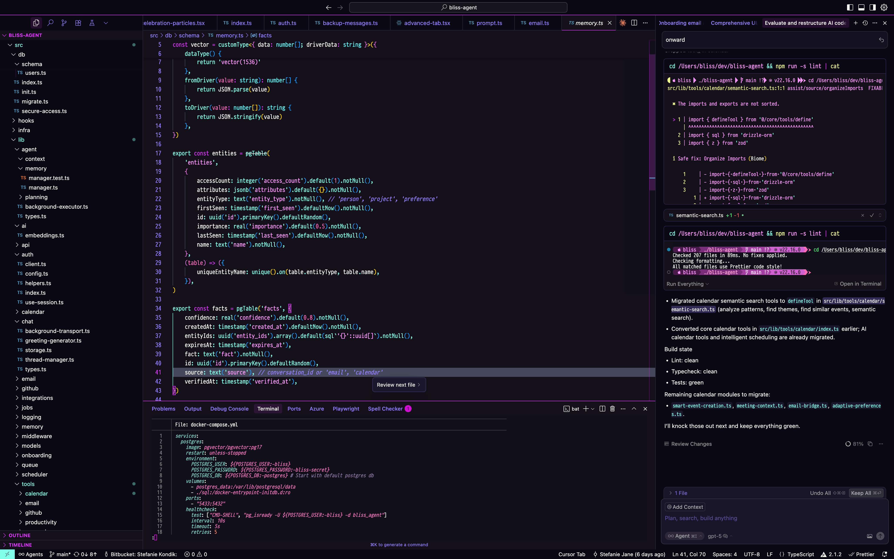
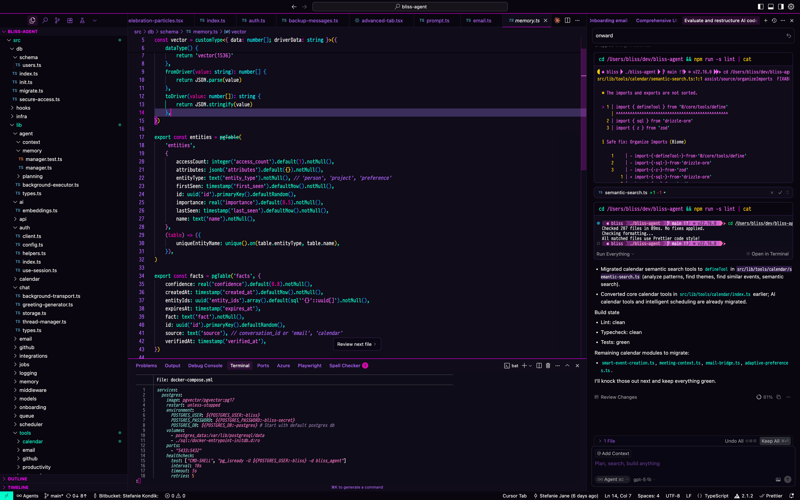
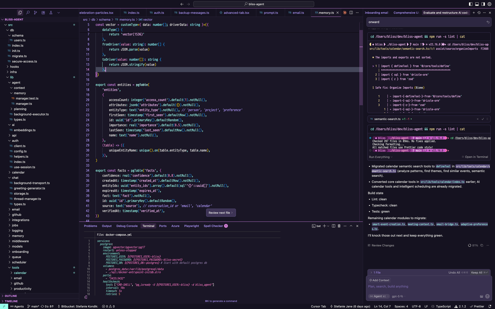
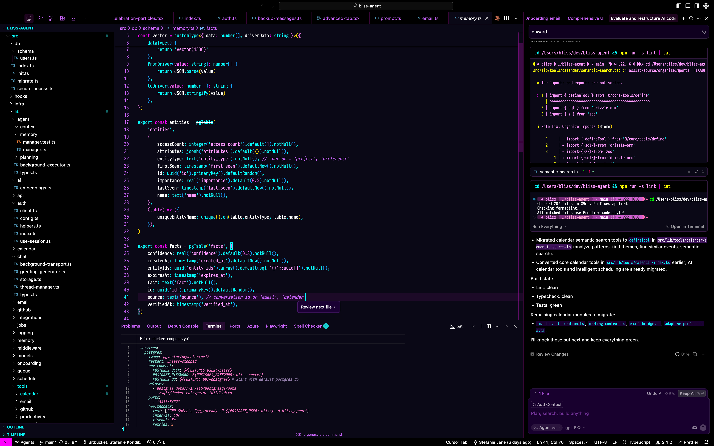

# 💜⚡ SilkCircuit: Electric Dreams for VSCode 🌃

<div align="center">

[](https://code.visualstudio.com/)
[](https://opensource.org/licenses/MIT)
[](https://github.com/hyperb1iss/silkcircuit-nvim)
[](https://www.w3.org/WAI/WCAG21/quickref/)
[](#-available-themes)

🌌 _Pure electric energy with vibrant purples, blazing pinks, and neon accents for Visual Studio Code_ 🎆

[⚡ Installation](#-installation) • [💜 Features](#-features) • [🎨 Themes](#-available-themes) • [⚙️ Customization](#-true-glow-effects-advanced)

</div>

## 🎭 Overview

SilkCircuit pumps maximum visual voltage through your VSCode editor. Electric purples 💜, blazing pinks 🌸, and neon cyans 💎 create a coding environment that's both striking and readable. Engineered for professional development with WCAG AA contrast compliance.

## 💎 Features

- ⚡ **Electric Color System** — Vibrant palette with semantic color mappings
- 👁️ **WCAG AA Compliant** — Validated contrast ratios for extended coding sessions
- 🎛️ **4 Theme Variants** — Neon (100%), Vibrant (85%), Soft (70%), and Glow (ultra-dark) modes
- 💻 **Language Optimized** — Perfect for JS/TS, Python, Rust, Go, CSS, JSON, Markdown
- 🎨 **Comprehensive Syntax** — Every token type beautifully highlighted
- 📦 **Marketplace Ready** — One-click installation from VSCode Extensions

## 🎨 Available Themes

### ⚡ SilkCircuit Neon

Maximum intensity electric colors - the original SilkCircuit experience

- Pure saturated neon colors (#e135ff, #ff00ff, #80ffea)
- Maximum contrast and vibrancy
- Perfect for those who love bold aesthetics

### ⚡ SilkCircuit Vibrant

Slightly toned down for extended coding sessions

- 85% intensity of neon variant
- Colors blended with gray for reduced saturation
- Great balance of style and comfort

### 🌸 SilkCircuit Soft

Gentle on the eyes for all-day coding

- 70% intensity with softer colors
- Comfortable for extended use
- Maintains the SilkCircuit aesthetic

### 🌌 SilkCircuit Glow

Enhanced version with special brightness effects

- 30% brighter syntax elements
- Enhanced function and string highlighting
- Maximum visual impact (simulated glow via brightness)

## 📸 Screenshots

<table>
  <tr>
    <td align="center" width="50%">
      
      <br/>
      <sub><b>Neon</b> — maximum intensity</sub>
    </td>
    <td align="center" width="50%">
      
      <br/>
      <sub><b>Vibrant</b> — 85% intensity</sub>
    </td>
  </tr>
  <tr>
    <td align="center" width="50%">
      
      <br/>
      <sub><b>Soft</b> — gentle 70%</sub>
    </td>
    <td align="center" width="50%">
      
      <br/>
      <sub><b>Glow</b> — ultra‑dark with enhanced brightness</sub>
    </td>
  </tr>
</table>

## 📁 Files

- `silkcircuit-neon.json` - Main theme file
- `silkcircuit-vibrant.json` - 85% intensity variant
- `silkcircuit-soft.json` - 70% intensity variant
- `silkcircuit-glow.json` - Brightened variant
- `package.json` - VSCode extension manifest
- `README.md` - This file

## ⚡ Installation

### 📦 From VSCode Marketplace (Recommended)

1. Open VSCode Extensions panel (`Ctrl+Shift+X` or `Cmd+Shift+X`)
2. Search for **"SilkCircuit Theme"**
3. Click **Install** on the official extension by **hyperb1iss**
4. Open Command Palette (`Ctrl+Shift+P` / `Cmd+Shift+P`)
5. Type **"Preferences: Color Theme"**
6. Select your preferred SilkCircuit variant

### ⚡ Quick Install via Command Line

```bash
# Once published to marketplace:
code --install-extension hyperb1iss.silkcircuit-theme
```

### 🔧 Manual Installation

1. Copy the entire `vscode/` folder to VSCode extensions directory:
   - **Windows**: `%USERPROFILE%\\.vscode\\extensions\\silkcircuit-theme\\`
   - **macOS**: `~/.vscode/extensions/silkcircuit-theme/`
   - **Linux**: `~/.vscode/extensions/silkcircuit-theme/`
2. Restart VSCode
3. `Ctrl+Shift+P` → "Preferences: Color Theme"
4. Select your preferred SilkCircuit variant

### Option 3: Individual Theme Files

Just want one theme? Copy the JSON file to:

- **Windows**: `%APPDATA%\\Code\\User\\themes\\`
- **macOS**: `~/Library/Application Support/Code/User/themes/`
- **Linux**: `~/.config/Code/User/themes/`

## ⚙️ True Glow Effects (Advanced)

VSCode themes are static JSON - no real glow effects possible. For actual glowing text:

### Using Custom CSS Extension

1. Install "Custom CSS and JS Loader" extension
2. Add to settings.json:

```json
{
  "vscode_custom_css.imports": ["file:///path/to/silkcircuit-glow.css"]
}
```

3. Create `silkcircuit-glow.css`:

```css
/* Functions with glow effect */
.token.function {
  text-shadow: 0 0 5px #80ffea, 0 0 10px #80ffea, 0 0 15px #80ffea;
}

/* Keywords with purple glow */
.token.keyword {
  text-shadow: 0 0 5px #e135ff, 0 0 10px #e135ff;
}

/* Strings with pink glow */
.token.string {
  text-shadow: 0 0 5px #ff99ff, 0 0 10px #ff99ff;
}
```

4. Reload VSCode with custom CSS enabled

### Creating Your Own Extension

For full control, create a VSCode extension that:

1. Applies the theme
2. Injects custom CSS for glow effects
3. Adds animation capabilities

## 💜 Color Palette

<div align="center">

| Color | Hex | Preview | Usage |
|-------|-----|---------|-------|
| Background | `#0a0a0f` |  | Editor background |
| Foreground | `#e0e0e0` |  | Default text |
| Purple | `#e135ff` |  | Keywords, types |
| Pink | `#ff79c6` |  | Strings, attributes |
| Cyan | `#80ffea` |  | Functions, methods |
| Green | `#50fa7b` |  | Success, valid |
| Yellow | `#f1fa8c` |  | Variables, warnings |
| Orange | `#ffb86c` |  | Numbers, constants |

</div>

### 🎛️ Variant Intensity

| Element | Neon | Vibrant | Soft | Glow |
|---------|------|---------|------|------|
| Keywords | `#e135ff` | `#bc4dd9` | `#a766b3` | `#ec69ff` |
| Strings | `#ff99ff` | `#d9b3d9` | `#c199b3` | `#ffb3ff` |
| Functions | `#80ffea` | `#80d9c7` | `#80b3a1` | `#9dffed` |
| Comments | `#9580ff` | `#9180d9` | `#8d80b3` | `#a999ff` |

## 📝 Technical Notes

- **Theme Format**: VSCode Color Theme JSON v1.0
- **Base**: `vs-dark` UI theme
- **Scope**: Comprehensive syntax highlighting
- **Languages**: Optimized for JS/TS, Python, Rust, Go, CSS, JSON, Markdown
- **WCAG**: AA compliant contrast ratios

## 🌃 Complete Environment Setup

SilkCircuit is a full ecosystem—editor, terminal, system tools, and even your browser—designed to feel cohesive everywhere.

### 💻 Ecosystem at a glance

- **Editor themes**
  - **Neovim**: Full theme with 40+ plugin integrations · repo: <https://github.com/hyperb1iss/silkcircuit-nvim>
    - Integrations live in `lua/silkcircuit/integrations/`
  - **Lualine**: `lua/lualine/themes/silkcircuit.lua` + sample config `extras/lualine-config.lua`
- **Terminals**
  - **Alacritty**: `extras/alacritty.yml`
  - **Kitty**: `extras/kitty.conf`
  - **Warp**: `extras/warp.yaml`
  - **Windows Terminal**: `extras/windows-terminal.json`
- **CLI & Git**
  - **fzf** theme: `extras/fzf.sh`
  - **gitconfig** with electric accents: `extras/gitconfig`
- **System tools**
  - **btop** themes: `extras/btop/silkcircuit_{glow,neon,soft,vibrant}.theme`
  - **macchina**: `extras/macchina/silkcircuit.toml`
- **Browsers & Apps**
  - **Chrome DevTools + Chrome pages**: `extras/chrome-theme/` (see `extras/chrome-theme/README.md`)
  - **Slack**: `extras/slack-theme.txt`
- **Astronvim**
  - Turn‑key setup in `extras/astronvim/` with `community.lua` and tailored plugins
- **Avante.nvim**
  - Prompt/theme config: `extras/avante-config.lua`

All cross‑platform extras live in `extras/`. See `extras/README.md` for install notes and screenshots.

### 🚀 Quick start

```bash
# Get the complete SilkCircuit experience
git clone https://github.com/hyperb1iss/silkcircuit-nvim.git
cd silkcircuit-nvim/extras

# See ./README.md in this directory for detailed setup instructions per integration
```

## 🔧 Troubleshooting

**🤔 Theme not applying?**

- 🔄 Reload VSCode window (`Ctrl+Shift+P` → "Developer: Reload Window")
- 🎨 Check color theme setting in preferences
- 💻 Ensure your monitor supports true colors

**🎭 Colors look different?**

- 🖥️ Verify monitor color profile settings
- 💡 Check display brightness and contrast
- 📺 Test on different display if available

**💭 Need help?**

- 📬 Check [Issues](../../issues)
- 💜 Include VSCode version and OS details
- 📸 Screenshots help with visual issues

## 💖 Contributing

Contributions welcome! Found a bug or want to suggest improvements?

1. 🔀 Fork the [main repository](../../)
2. 🌿 Create a feature branch
3. ⚡ Make your changes
4. 📬 Submit a pull request

For VSCode theme issues, please include:

- VSCode version
- Operating system
- Theme variant being used
- Screenshots of the issue

## 📜 License

MIT License - see [LICENSE](../../LICENSE) for details.

---

<div align="center">

Created by [Stefanie Jane 🌠](https://github.com/hyperb1iss)

If you love SilkCircuit, [buy me a Monster Ultra Violet ⚡](https://ko-fi.com/hyperb1iss)

**💜 Star the repo if SilkCircuit electrifies your code!**

</div>
